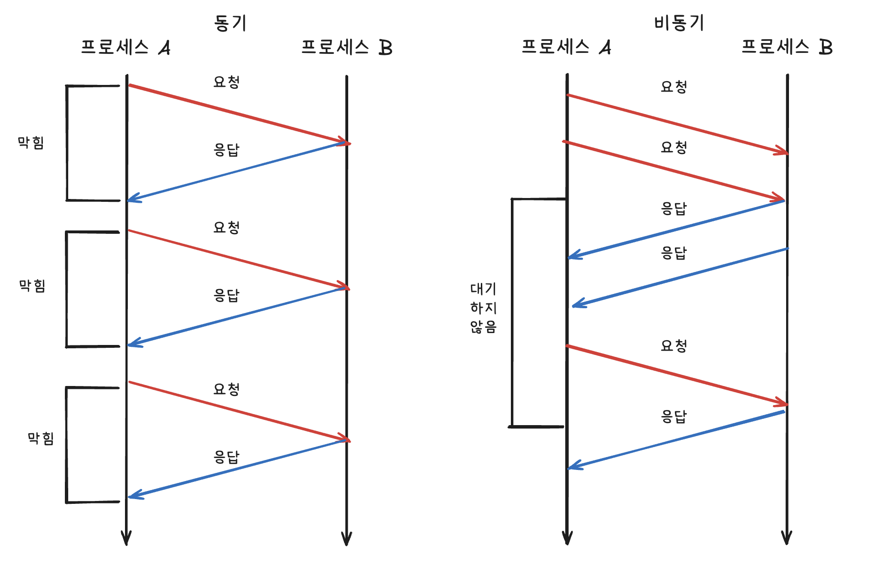
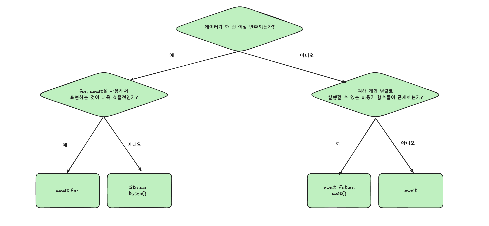

# Dart 비동기 프로그래밍

## ✅ 1. 동기
- 한 작업이 끝나야 다음 작업을 실행함
- 작업들이 순차적으로 실행됨
- `blocking`방식 -> 이전 작업이 끝날 때까지 기다림.
```dart
void main() {
  print('A');
  print('B');
  print('C');
}
```

## ✅ 2. 비동기
- 시간이 오래 걸릴 수 있는 작업을 미뤄두고, 다음 작업을 먼저 실행함
- 대표적인 비동기 작업 : API 호출, 파일 읽기, 타이머 등
- `Future`, `async`, `await` 키워드를 통해 구현


---

## ✅ 2-1. `Future`
- `Future`클래스는 `미래`라는 단어의 의미대로 미래에 받아올 값을 뜻함
- `List`나 `Set`처럼 제네릭으로 어떤 미래의 값을 받아올지를 정할 수 있음

```dart
Future<String> name;  // 미래에 받을 String값
Future<int> number;  // 미래에 받을 int값
Future<bool> inOpened;  // 미래에 받을 boolen값
```
비동기 프로그래밍은 서버 요청과 같이 오래 걸리는 작업을 기다린 후 값을 받아와야 하기 때문에 미래의 값을 표현하는 `Future`클래스가 필요함!
특정 기간 동안 아무것도 하지 않고 기다리는 `Future.delayed()`를 사용!

```dart
// Future

void main() {
  addNumbers(1, 1);
}

void addNumbers(int number1, int number2) {
  print("$number1 + $number2 계산 시작!");

// Future.delayed()를 사용하면 일정 시간 후에 콜백 함수를 실행할 수 있음
Future.delayed(Duration(seconds: 3), (){
  print("$number1 + $number2 = ${number1 + number2}");
});

print("$number1 + $number2 코드 실행 끝");
}
```
- 첫 번째 파라미터에 대기할 시간 `Duration(seconds: 3)`을 입력하고 두 번째 파라미터에 대기 후 실행할 콜백 함수를 입력
- 그러면 `addNumbers()`함수는 `print()`함수를 실행하고 `Future.delayed()`를 통해 3초간 대기
- 그 후 마지막 `print()`함수를 실행하게 되는 구조

그러면 마지막 `print()`는 `Future.delayed()`안에 있는 `print()` 후에 호출되는거 아닌가??
=> 아님! `Future.delayed()`는 비동기 연산이기 때문에 CPU가 3초간 대기해야 한다는 메세지를 받으면 리소스를 낭비하지 않고 다음 코드를 실행함!

---

## ✅ 2-1. `async`와 `await`
- `async`와 `await`키워드를 사용하면 비동기 프로그래밍을 유지하면서 코드 가독성을 유지할 수 있음!

# `async`
- 함수 선언할 때 붙임
- 이 함수 안에는 비동기 코드가 들어올 수 있다고 `Dart`에게 알려주는 것
- 반환값은 보통 `Future<T>`형식이 됨

```dart
// async와 await

void main() {
  addNumbers(1, 1);
}

// async키워드는 함수 파라미터 정의와 바디 사이에 입력
Future<void> addNumbers(int number1, int number2) async {
  print("$number1 + $number2 계산 시작!");
  
  await Future.delayed(Duration(seconds: 3), (){
    print("$number1 + $number2 = ${number1 + number2}");
  });
  
  print("$number1 + $number2 코드 실행 끝");
}
```
```dart
/* 출력값
1 + 1 계산 시작!
1 + 1 = 2
1 + 1 코드 실행 끝
*/
```
위 코드처럼 함수를 `async`로 지정해주고 대기하고 싶은 비동기 함수를 실행할 때 `await`키워드를 사용하면 코드는 작성한 순서대로 실행됨

그러면 비동기 프로그래밍이 아니라 동기 프로그래밍이 되는거 아님?
=> 아님! `async`와 `await`키워드를 사용하면 비동기 프로그래밍 특징을 그대로 유지하며 프로그램이 실행됨

그러면 `void main()`에 `addNumbers(2, 2)`를 추가해보면 답이 나옴

```dart
void main() {
 addNumbers(1, 1);
 addNumbers(2, 2);
}
```

```dart
/* 출력값
1 + 1 계산 시작!
2 + 2 계산 시작!
1 + 1 = 2
1 + 1 코드 실행 끝
2 + 2 = 4
2 + 2 코드 실행 끝
*/
```
왜 이런 결과가 나왔지?
=> `addNumbers()`함수가 두 번 실행됐음. 근데, `addNumbers(1, 1)`가 끝나기 전에 `addNumbers(2, 2)`가 실행된거임.
그 이유는, `addNumbers()`가 비동기로 실행됐기 떄문임. `addNumbers(1, 1)`의 `Future.delayed()`가 실행되며 3초를 기다려야할 때,
CPU의 리소스를 낭비하지 않고 다음 실행할 코드인 `addNumbers(2, 2)`가 실행된 것임

그러면 `addNumbers(1, 1)`과 `addNumbers(2, 2)`가 둘다 순차적으로 실행되기 원한다면??

```dart
// addNumbers가 둘 다 순차적으로 실행되는 방법
void main() async {
  await addNumbers(1, 1);
  await addNumbers(2, 2);
}

Future<void> addNumbers(int number1, int number2) async {
  print("$number1 + $number2 계산 시작!");
  
  await Future.delayed(Duration(seconds: 3), () {
    print("$number1 + $number2 = ${number1 + number2}");
  });
  
  print("$number1 + $number2 코드 실행 끝");
}

/* 출력값
1 + 1 계산 시작!
1 + 1 = 2
1 + 1 코드 실행 끝
2 + 2 계산 시작!
2 + 2 = 4
2 + 2 코드 실행 끝
*/
```
이렇게 하면 `addNumbers(1, 1)`이 다 실행되고나서 `addNumbers(2, 2)`가 실행됨

---

## ✅ 2-1. `async`와 `await`
`async`와 `await`키워드를 사용한 함수에서도 결과값을 받을 수 있음. 이때 `Future`클래스를 사용함
위 `addNumbers()`함수의 코드를 수정해서 작성해봄

```dart
// async와 await 키워드를 사용한 함수에서 결과값 받기

void main() async {
  final result = await addNumbers(1, 1);
  print("결과값 $result");
  
  final result2 = await addNumbers(2, 2);
  print("결과값 $result2");
}

Future<int> addNumbers(int number1, int number2) async {
  print("number1 + $number2 계산 시작!");
  
  await Future.delayed(Duration(seconds: 3), (){
    print("$number1 + $number2 = ${number1 + number2}");
  });
 
  print("$number1 + $number2 코드 실행 끝");
  
  return number1 + number2;
}
```
```dart
/* 출력값
number1 + 1 계산 시작!
1 + 1 = 2
1 + 1 코드 실행 끝
결과값 2
number1 + 2 계산 시작!
2 + 2 = 4
2 + 2 코드 실행 끝
결과값 4
*/
```
---

## ✅ 2-2. `Stream`
- `Future`는 한 번만 값을 비동기로 전달
- `Stream`은 여러 개의 값을 시간 간격을 두고 비동기로 전달
- 예를 들면, 센서 값, 사용자 입력, 채팅 메세지 등 계속 들어오는 데이터를 다룰 때 사용


---

## ✅ 2-2-1. `Stream` 기본 사용법
- `Stream`을 사용하려면 플러터에서 기본으로 제공하는 `dart:async`패키지를 불러와야함
- `dart:async`패키지에서 제공하는 `StreamController`를 `listen()`해야 값을 지속적으로 반환 받을 수 있음

```dart
// Stream 기본 사용법
import "dart:async";

void main() {
  final controller = StreamController(); // StreamController 선언
  final stream = controller.stream; // 스트림 가져오기
  
  // Stream에 listen() 함수를 실행하면 값이 주입될 때마다 콜백 함수를 실행할 수 있음
  final streamListener1 = stream.listen((val) {
    print(val);
  });
  
  // Stream에 값을 주입하기
  controller.sink.add(1);
  controller.sink.add(2);
  controller.sink.add(3);
  controller.sink.add(4);
}
```

---

## ✅ 2-2-2. 브로드캐스트 스트림
스트림은 단 한번만 `listen()`을 실행할 수 있음
하지만 하나의 스트림을 생성하고 여러 번 `listen()`함수를 실행할 때가 있음. 이 때 브로드캐스트 스트림을 사용하면 스트림을 여러번 `listen()`하도록 변환할 수 있음

```dart
import "dart:async";

void main() {
  final controller = StreamController();
  
  // 여러 번 리슨할 수 있는 Broadcast Stream 객체 생성
  final stream = controller.stream.asBroadcastStream();
  
  // 첫 번째 listen() 함수
  final streamListener1 = stream.listen((val) {
    print("listening 1");
    print(val);
  });
  
  // 두 번째 listen() 함수
  final streamListener2 = stream.listen((val) {
    print("listening 2");
    print(val);
  });
  
  // add()를 실행할 때마다 listen()하는 모든 콜백 함수에 값이 주입됨
  controller.sink.add(1);
  controller.sink.add(2);
  controller.sink.add(3);
}
```

---

## ✅ 2-2-3. 함수로 스트림 반환하기
`StreamController`를 직접 사용하지 않고도 직접 스트림을 반환하는 함수를 작성할 수 있음
`Future`를 반환하는 함수를 `async`로 함수를 선언하고 `return`키워드로 값을 반환하면 됨
스트림을 반환하는 함수는 `async*`로 함수를 선언하고 `yield`키워드로 값을 반환해주면 됨

```dart
// 함수로 스트림 반환하는 방법
import "dart:async";

// Stream을 반환하는 함수는 async로 선언함
Stream<String> calculate(int number) async* {
  for (int i = 0; i < 5; i++) {
    
    // StreamController의 add()처럼 yield 키워드를 이용해서 값 변환
    yield 'i = $i';
    await Future.delayed(Duration(seconds: 1));
  }
}

void playStream() {
  calculate(1).listen((val){
    print(val);
  });
}

void main() {
  playStream();
}
```

---
